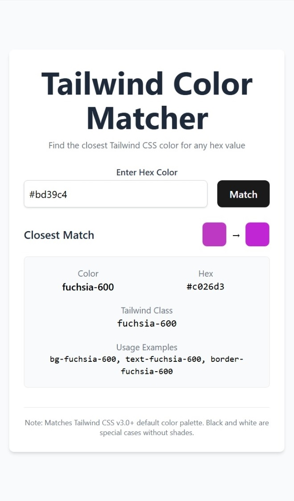

# Tailwind Color Matcher



**Tailwind Color Matcher** is a React + TypeScript web app that finds the closest matching Tailwind CSS color for any custom hex value. Ideal for developers who want to align custom brand colors with Tailwind’s default palette.

## ✨ Features

- 🎨 Enter any hex color value
- 🔍 Find the closest Tailwind CSS color match
- 📋 Copy the matching Tailwind class name (e.g., `bg-blue-500`)
- 🖥️ Visual comparison between input and matched color
- ⚡ Built with Vite, React, and TypeScript for blazing-fast performance
- 🌈 Supports all default Tailwind CSS v3.0+ colors

## 🚀 Live Demo

👉 [Live Demo](https://rezelahi.github.io/tailwind-color-matcher/)

## 🚀 Deployment

This project is configured for automatic deployment to GitHub Pages. Here are the deployment options:

### Automatic Deployment (Recommended)

The project uses GitHub Actions for automatic deployment. Every push to the `main` branch will trigger a deployment.

### Manual Deployment

If you prefer manual deployment:

```bash
# Build the project
npm run build

# Deploy to GitHub Pages
npm run deploy
```

### GitHub Pages Setup

1. Go to your repository settings
2. Navigate to "Pages" section
3. Set source to "GitHub Actions"
4. The site will be available at: `https://rezelahi.github.io/tailwind-color-matcher/`

## 📦 Installation

```bash
# Clone the repo
git clone https://github.com/your-username/tailwind-color-matcher.git

# Move into the project directory
cd tailwind-color-matcher

# Install dependencies
npm install

# Start the development server
npm run dev
```

## 🧑‍💻 Usage

1. Enter a hex color (e.g., `#3b82f6`)
2. Click "Match" or press **Enter**
3. Get:

   - Tailwind color name + shade (e.g., `blue-500`)
   - Hex value
   - Class name (e.g., `bg-blue-500`)
   - Live preview

## 🧠 How It Works

- Converts hex to RGB
- Calculates Euclidean distance between input color and Tailwind palette
- Selects the nearest color match
- Special handling for black (`#000000`) and white (`#ffffff`)

## 🛠 Tech Stack

- [Vite](https://vitejs.dev/)
- [React](https://reactjs.org/)
- [TypeScript](https://www.typescriptlang.org/)
- [Tailwind CSS](https://tailwindcss.com/)

## 📁 Project Structure

```
tailwind-color-matcher/
├── public/
│   └── screenshot.png
├── src/
│   ├── components/
│   ├── data/
│   ├── utils/
│   ├── App.tsx
│   └── main.tsx
├── tailwind.config.js
├── tsconfig.json
├── vite.config.ts
└── package.json
```

## 🤝 Contributing

1. Fork this repository
2. Create your feature branch (`git checkout -b feature/awesome-feature`)
3. Commit your changes (`git commit -m 'Add awesome feature'`)
4. Push to the branch (`git push origin feature/awesome-feature`)
5. Open a Pull Request

## 📄 License

This project is licensed under the [MIT License](LICENSE)

## 📬 Contact

**Reza Elahi**

<!-- [@yourtwitter](https://twitter.com/yourtwitter) -->
<!-- 📧 [your.email@example.com](mailto:your.email@example.com) -->

GitHub: [https://github.com/rezelahi](https://github.com/rezelahi)
