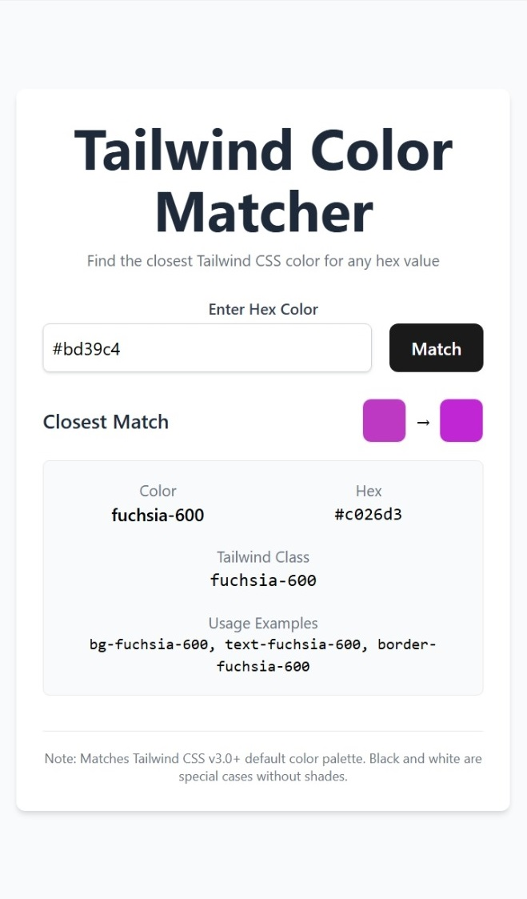

```markdown
# Tailwind Color Matcher



A React application that finds the closest matching Tailwind CSS color for any given hex value. Perfect for developers working with Tailwind who need to match custom colors to the nearest Tailwind default color.

## Features

- 🎨 Input any hex color value
- 🔍 Find the closest matching Tailwind CSS color
- 📋 Copy the exact Tailwind class name (e.g., `bg-blue-500`, `text-white`)
- 🖥️ Visual comparison of input vs. matched color
- ⚡ Built with Vite + React + TypeScript for fast performance
- 🌈 Supports all Tailwind CSS v3.0+ default colors

## Live Demo

[View live demo](https://your-deployed-app-url.here) <!-- Replace with your actual deployment URL -->

## Installation

1. Clone the repository:
   ```bash
   git clone https://github.com/your-username/tailwind-color-matcher.git
   ```
2. Navigate to the project directory:
   ```bash
   cd tailwind-color-matcher
   ```
3. Install dependencies:
   ```bash
   npm install
   ```
4. Start the development server:
   ```bash
   npm run dev
   ```

## Usage

1. Enter a hex color in the input field (e.g., `#3b82f6`)
2. Click "Match" or press Enter
3. View the closest Tailwind CSS match including:
   - Color name and shade (e.g., `blue-500`)
   - Exact hex value
   - Tailwind class name (e.g., `bg-blue-500`)
   - Usage examples

## How It Works

The application uses color distance algorithms to find the closest match in the Tailwind color palette:

1. Converts hex values to RGB
2. Calculates Euclidean distance between colors
3. Finds the Tailwind color with the smallest distance
4. Special handling for pure black (#000000) and white (#ffffff)

## Technologies Used

- [Vite](https://vitejs.dev/) - Next generation frontend tooling
- [React](https://reactjs.org/) - JavaScript library for building user interfaces
- [TypeScript](https://www.typescriptlang.org/) - Typed JavaScript
- [Tailwind CSS](https://tailwindcss.com/) - Utility-first CSS framework
- [ESLint](https://eslint.org/) - JavaScript linter
- [Prettier](https://prettier.io/) - Code formatter

## Project Structure

```
tailwind-color-matcher/
├── src/
│   ├── components/       # React components
│   ├── data/             # Color data files
│   ├── utils/            # Utility functions
│   ├── App.tsx           # Main application component
│   └── main.tsx          # Application entry point
├── public/               # Static assets
├── package.json          # Project dependencies
├── tailwind.config.js    # Tailwind configuration
├── tsconfig.json         # TypeScript configuration
└── vite.config.ts        # Vite configuration
```

## Contributing

Contributions are welcome! Please follow these steps:

1. Fork the project
2. Create your feature branch (`git checkout -b feature/AmazingFeature`)
3. Commit your changes (`git commit -m 'Add some AmazingFeature'`)
4. Push to the branch (`git push origin feature/AmazingFeature`)
5. Open a Pull Request

## License

Distributed under the MIT License. See `LICENSE` for more information.

## Contact

Your Name - [@yourtwitter](https://twitter.com/yourtwitter) - your.email@example.com

Project Link: [https://github.com/your-username/tailwind-color-matcher](https://github.com/your-username/tailwind-color-matcher)
```

### To use this README:

1. Save it as `README.md` in your project root
2. Replace placeholder values (your name, contact info, GitHub URLs)
3. Add a screenshot named `screenshot.png` to your `public` folder
4. Update the "Live Demo" link when you deploy your app
5. Customize any sections to better match your project

This README includes:
- Clear project description
- Visual screenshot
- Feature highlights
- Installation instructions
- Usage guide
- Technology stack
- Project structure
- Contribution guidelines
- Licensing information
- Contact details
